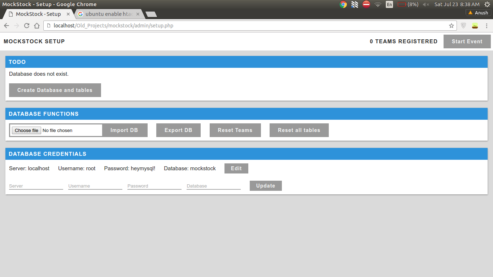
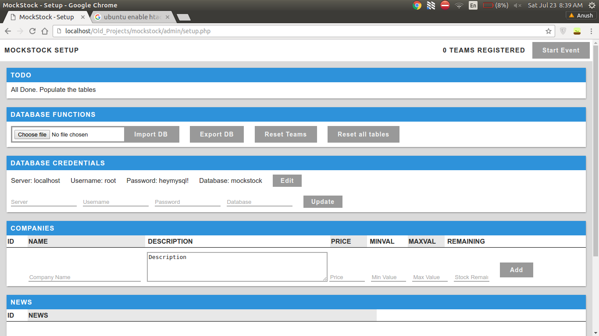
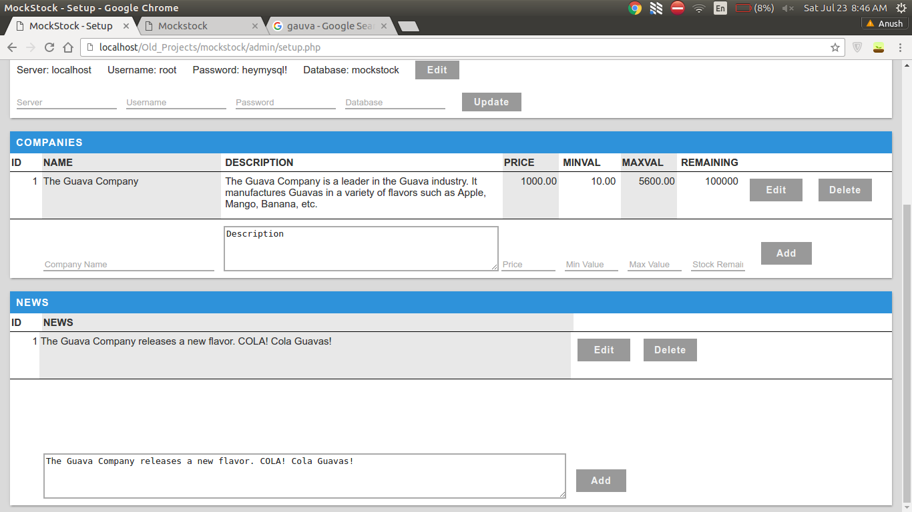
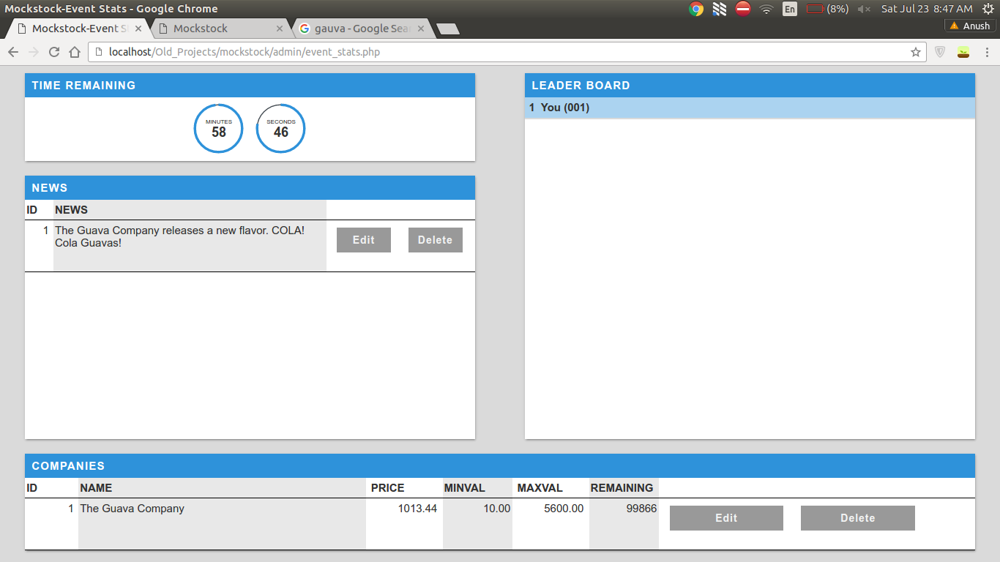
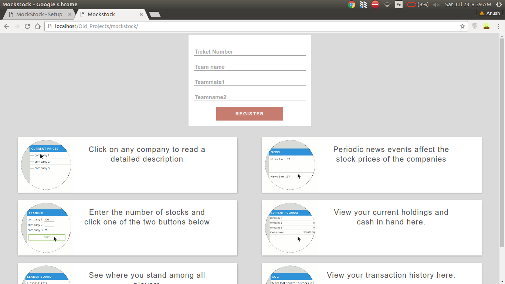
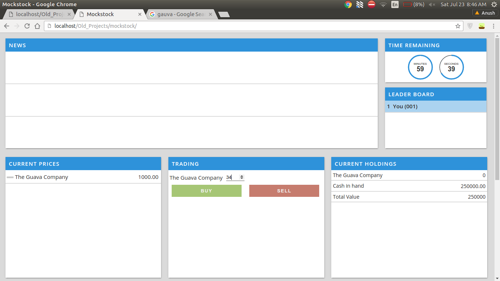
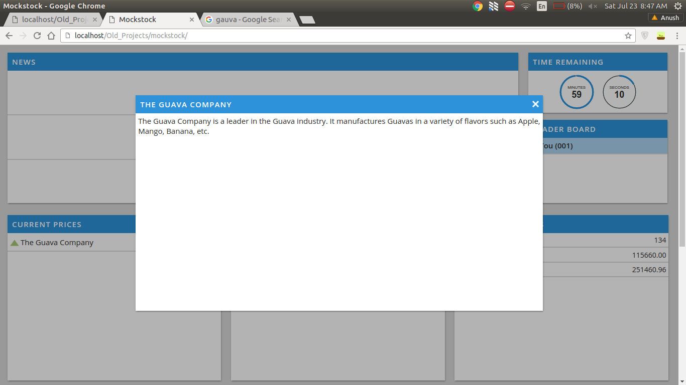
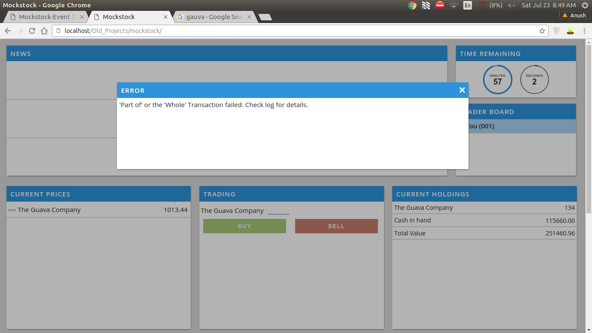
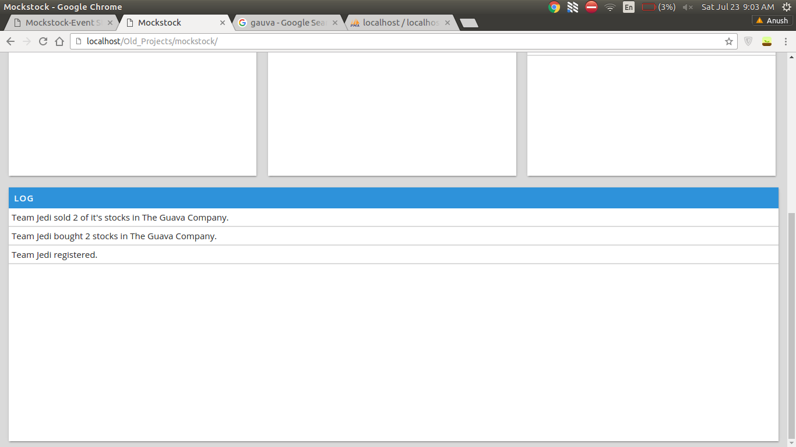

### :chart_with_upwards_trend: MOCKSTOCK

This GUI application was developed for an inter-college competition.  
The competition tries to emulate the stock market adn rhe price flutuates based on the volume of stock available and periodic news events pertaining to the stock.

#### URLs
[Admin GUI](https://mockstock.herokuapp.com/admin/setup.php)  
username: admin    Password: bnmit_tatva

[User GUI](https://mockstock.herokuapp.com/)

#### Screenshots: Admin GUI

The *TODO* card shows the next task to be performed  
  

  

The *Companies* and *News* cards contain forms to add data and also display existing data  
  

The *Event Stats* page shows the essential information such as upcoming news items and time  
  

#### Screenshots: User GUI

The team registeration page  
  

Once the event starts, the user has 3 minutes to read about each company by clicking on it. After 3 minutes news events arrive in an interval of 30 seconds.  
You can also view the *current prices* and your *holdings*. An *indicator* preceeding the company name indicates the movement of stock price.  
  

  

  

Useful information is provided in the *Log* card  
  

  